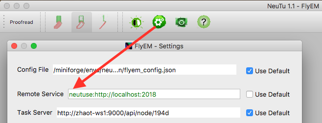

# Desciption

neutuse is a flexible serive oriented framework designed for connectome reconstrucion. 
For details, see [wiki page](https://github.com/ephemera2015/neutuse/wiki)  

# Installation

For running database, you should install pyzem first (https://github.com/janelia-flyem/pyzem)  
git clone https://github.com/ephemera2015/neutuse.git   
cd neutuse   
python setup.py install

After Installation you may run tests by:
python tests/test.py

If everything is fine, you should see 'OK' at the bottom of the screen
# Usage
    1) Run database:
    neutuse run database [-a ADDR] [-b BACKEND] [-d DEBUG] [-r RETRY] [-l LOG] [-c CONFIG]
    ADDR: Address that the data base will be running, default is 127.0.0.1:5000.
    BACKEND: Backend of the data base, default is sqlite:///test.db.
    DEBUG: Enable debug mode or not.
    RETRY: Enable retry mechanism or not. If this is turned on, expired tasks will be fetched again.
    LOG: Log file.
    CONFIG: Config file. If this option has been set, neutuse will load options from config file. (Exmpale config file: docs/database_config.yaml)
    
    2) Run process:
    neutuse run process NAME [-a ADDR] [-n NUMBER] [-l LOG] [-c CONFIG]
    ADDR: Address that the data base is running, default is 127.0.0.1:5000.
    NAME: The name of the process to run.
    NUMBER: Numbers of workers.
    LOG: Log file.
    CONFIG: Config file. If this option has been set, neutuse will load options from config file. (Exmpale config file: docs/process_config.yaml)
    
    3) Post task:
    neutuse post FILE [-a ADDR]
    ADDR: Address the database is running, default is 127.0.0.1:5000.
    FILE: The name of file that describes the task.
    

## Example setup (localhost)

Run neutuse and the skeletonization service locally

### Install neutuse and pyzem

```
git clone https://github.com/janelia-flyem/neutuse
cd neutuse
python setup.py install
cd ..

git clone https://github.com/janelia-flyem/pyzem
cd pyzem
python setup.py install
cd ..
```

### Write configs

**NOTE:** Edit the `command` below to point to the correct conda environment! 

```
mkdir neutuse-configs
cd neutuse-configs

$ cat > skeletonize_config.yaml << EOF
number: 1
log: /tmp/neutuse_skeletonize.log
command: /miniconda/envs/neutu/bin/neutu
EOF

cat > process_config.yaml << EOF
address:
    host: localhost
    port: 2018
number: 1
log: /tmp/neutuse.log
process:
    - name: skeletonize
      config: skeletonize_config.yaml
EOF
```

### Launch service and polling process

```
neutuse start database --config process_config.yaml

# (in a separate terminal)
neutuse start process --config process_config.yaml
```

### Configure NeuTu

Click the settings button, and set "Remote Service" to:

```
neutuse:http://localhost:2018
```


